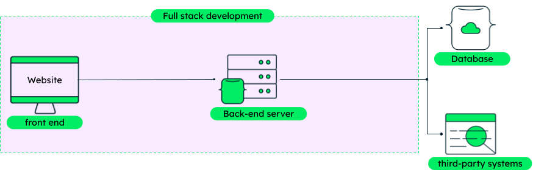

# 

**Learning objective:** By the end of this lesson, students will be able to define client/server architecture.

## Client/server architecture

The terms *client* and *server*, used in everyday language, typically refer to a physical device for simplicity. When many think of servers, the first thing that comes to mind is an enormously powerful computer inside a data center. Many people think of their personal devices exclusively as clients.

However, as a developer, taking a more nuanced approach is necessary. When we use the terms *client* and *server*, we'll primarily be referring to software processes and the role those processes play instead. So then, what makes the role of client software different from the role of server software? Broadly:

- Client software creates requests for services.
- Server software responds to requests for services.

The word services used here is intentionally broad, as a client could request different things from a server. We refer to this interaction as the *request-response cycle*. Here's an example of the *request-response* cycle playing out:

1. A user navigates to a website in their browser by typing a URL.
2. The browser (the *client* software) creates and sends a *request* to the appropriate web *server* (the *server* software).
3. The web *server* receives the request and acts. In this case, it should respond with HTML.
4. The web *server* sends a *response* to the *client*.
5. The browser (the *client*) receives the *response* and displays the website to the user. The *request-response cycle* has concluded.

> 📚 *Clients* are software that create *requests* for services provided by a server. *Servers* are software that receives client requests and sends a *response* to the request for services. This communication pattern is the *request-response cycle*.

tktk Hunter, get with me (David) on a graphic for all of this. I have a couple of ideas, but I'm not sure how much is too much here, and it may be worth having multiple graphics. If we go in this direction, we should also reconsider other graphics that paint client/server as physical devices and reconceptualize those graphics in terms of pieces of software interacting with one another.

### Why is this distinction important?

While viewing the client and server this way may seem overly nuanced initially, it has important implications. For example, as a full-stack developer, you'll often run both client and server software on a single device simultaneously during development.

## What is full-stack development?

[Full stack development](https://www.mongodb.com/languages/full-stack-development) is building applications from both the front-end (client) and back-end (server) perspectives.

Recall the steps above:

> 1. A user navigates to a website in their browser by clicking a link.
> 2. The browser (the *client* software) creates and sends a *request* to the appropriate web *server* (the *server* software).
> 3. The web *server* receives the request and acts. In this case, it should respond with HTML.
> 4. The web *server* sends a *response* to the *client*.
> 5. The browser (the *client*) receives the *response* and displays the website to the user. The *request-response* cycle has concluded.

A front-end developer will typically only be concerned with what the user sees and how they interact with what they see (steps 1, 2, and 5 above).

A back-end developer will typically only be concerned with what happens in steps 3 and 4 - the actions get carried out in response to requests and the response to those requests. The user doesn't see these steps, but they're just as important.

A full-stack developer is involved in all of these steps. Because of this, they have to understand both front-end and back-end technologies. But by doing so, they can work on all aspects of a web application, from building the UI to developing the server-side logic, making full-stack devs valuable on the job market.

In addition to the front-end and back-end applications that they create, full-stack developers also have a good understanding of databases. Databases are used to store and manage the application's data. Common database technologies include MySQL, PostgreSQL, and MongoDB.

tktk hunter -- i stole this asset from the mongodb, but i think it's helpful.
