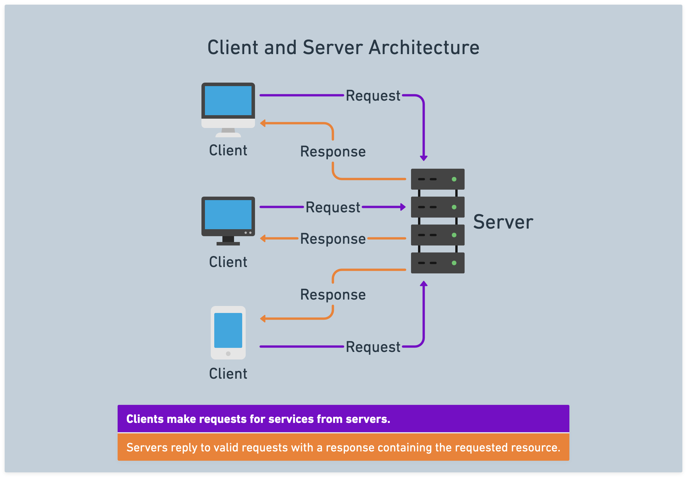

# 

**Learning objective:** By the end of this lesson, students will be able to define client/server architecture.

tktk Existing

## Client/server architecture

tktk hunter -- please make this prettier. Also, I prefer a server icon that looks something like this: <https://i.imgur.com/YqZANRo.png>. I feel it drives home the point that a server is just computer hooked up to the internet.

The terms *client* and *server* can refer to both a **physical device** (computer, tablet, phone, etc.) and to a **software process**. For example:

- A laptop computer could be thought of as a client, if it is being used to access the internet. Within that laptop, the web browser (e.g. Chrome, Firefox, etc) that is being used could be thought of as a software client. It will make requests for information from a server.
- A server, from the perspective of a software process, is an application who's job it is to respond to client requests for information. These applications will be running on a computer somewhere that is turned on and connected to the internet. In this situation, that computer can also be thought of as a server.

In the client and server architecture, clients make requests for information from servers. Servers then reply to requests with a response containing the requested information.

 Here's an example:

1. A user navigates to a website in their browser (the browser is the client).
2. The browser sends a request to the website's server, asking for the HTML code for the website.
3. The server processes the request and sends the HTML code back to the browser.
4. The browser displays the website to the user.

## What is full-stack development?

[Full stack development](https://www.mongodb.com/languages/full-stack-development) is the practice of building web applications from both the front-end (client-side) and back-end (server-side) perspectives. Full stack developers deeply understand front and back end technologies. They are able to work on all aspects of a web application, from building the user interface to developing the sever-side logic.

In addition to the front-end and back-end applications that they create, full stack developers also need to have a good understanding of databases. Databases are used to store and manage the application's data. Common database technologies include MySQL, PostgreSQL, and MongoDB.

tktk hunter -- i stole this asset from the mongodb link above, but i think it's helpful. Worth remaking since this doesnt work in dark mode lol.

tktk End existing

---

tktk Propose changing the above to

## Client/server architecture

The terms *client* and *server*, used in everyday language, typically refer to a physical device for simplicity. When many think of servers, the first thing that comes to mind is an enormously powerful computer inside a data center. Many people think of their personal devices exclusively as clients.

However, as a developer, taking a more nuanced approach is necessary. When we use the terms *client* and *server*, we'll primarily be referring to software processes and the role those processes play instead. So then, what makes the role of client software different from the role of server software? Broadly:

- Client software creates requests for services.
- Server software responds to requests for services.

The word services used here is intentionally broad, as a client could request different types of things from a server. We refer to this interaction as the *request-response cycle*. Here's an example of the *request-response* cycle playing out:

1. A user navigates to a website in their browser by typing a URL.
2. The browser (the *client* software) creates and sends a *request* to the appropriate web *server* (the *server* software).
3. The web *server* receives the request and acts. In this case, it should respond with HTML.
4. The web *server* sends a *response* to the *client*.
5. The browser (the *client*) receives the *response* and displays the website to the user. The *request-response cycle* has concluded.

> 📚 *Clients* are software that creates *requests* for services provided by a server. *Servers* are software that receives client requests and sends a *response* to the request for services. This communication pattern is the *request-response* cycle.

tktk Hunter, get with me on a graphic for all of this. I have a couple of ideas, but I'm not sure how much is too much here, and it may be worth having multiple graphics. If we go in this direction, we should also reconsider other graphics that paint client/server as physical devices and reconceptualize those graphics in terms of pieces of software interacting with one another.

### Why is this distinction important?

While viewing the client and server this way may seem overly nuanced initially, it has important implications. For example, as a full-stack developer, you'll often run both client and server software on a single device simultaneously during development.

## What is full-stack development?

[Full stack development](https://www.mongodb.com/languages/full-stack-development) is building applications from both the front-end (client) and back-end (server) perspectives.

Recall the steps above:

> 1. A user navigates to a website in their browser by clicking a link.
> 2. The browser (the *client* software) creates and sends a *request* to the appropriate web *server* (the *server* software).
> 3. The web *server* receives the request and acts. In this case, it should respond with HTML.
> 4. The web *server* sends a *response* to the *client*.
> 5. The browser (the *client*) receives the *response* and displays the website to the user. The *request-response* cycle has concluded.

A front-end developer will typically only be concerned with what the user receives as a response in step 5 and how the user will navigate around the site (steps one and two). In other words, what the user sees and how they interact with what they see.

A back-end developer will typically only be concerned with what happens in steps 3 and 4 - the actions get carried out in response to requests and the response to those requests. The user doesn't see these steps, but they're just as important.

A full-stack developer is involved in all of these steps. Because of this, they have to understand both front-end and back-end technologies. But by doing so, they can work on all aspects of a web application, from building the UI to developing the server-side logic, making full-stack devs valuable on the job market.

In addition to the front-end and back-end applications that they create, full-stack developers also have a good understanding of databases. Databases are used to store and manage the application's data. Common database technologies include MySQL, PostgreSQL, and MongoDB.

tktk hunter -- i stole this asset from the mongodb link above, but i think it's helpful. It's worth remaking since this doesnt work in dark mode lol.

tktk End proposal
