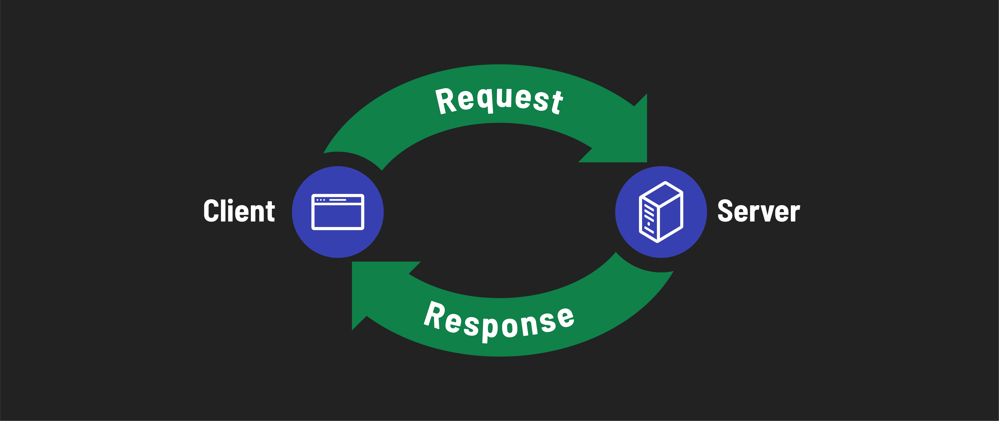

<h1>
  Intro to Full Stack Development
  Client Server Architecture
</h1>

**Learning objective:** By the end of this lesson, students will be able to explain the roles of client and server software in web development, and recognize the importance of this architecture in full-stack development.

## Client/Server architecture

In everyday conversation, the terms *client* and *server* are often used to describe physical devices. Typically, when people hear the term *server*, they imagine a large, powerful computer housed in a data center. Similarly, the term *client* is commonly associated with personal devices, like desktop/laptop computers and smartphones. However, these terms have different meanings in the context of web development.

In web development, *client* and *server* describe the functions of different software processes. Understanding the interaction between the client and the server is fundamental. Let's break it down into simpler terms:

- **Client Software:** The primary role of client software is to create requests for various *services*. For instance, when you want to visit a website, your browser (acting as the client) sends a request to fetch data from a webpage.

- **Server Software:** The primary role of server software is to respond to requests for *services*. This operates at the other end of the client-server relationship. When your browser, acting as the client, requests a webpage, this request is handled by the server software. Although the physical server might be located in a remote data center, we focus on the capabilities of software, not physical machines.

> 📚 As a developer, it's essential to understand that the terms *client* and *server* refer to ***roles played by software***, not physical devices. The term *services* is broad and encompasses various actions a server might perform in response to the client's requests, such as retrieving the correct webpage, processing data, or performing specific tasks.

## Why does this matter for full-stack developers?

As a full-stack developer, you'll work with code running on the ***client*** (what the user interacts with in the front-end) and the ***server*** (on the back-end, which the user doesn't interact with directly). Understanding client/server distinction is important for many reasons:

- During development, you'll be sending requests from your local **client** (like a browser or a testing tool) to your local **server**, mimicking the real-world process.
- You'll often set up a **server** on your own computer for development and testing. This allows you to run and test your app as if it were live on the internet.
- Understanding whether an issue originates from the client or the server side can greatly streamline the debugging process.
- Having an appreciation for the roles of a both the client and server is essential for understanding how to construct well-architected applications.

Remember, in this context, we're focusing on the software part of clients and servers, not the physical devices.
