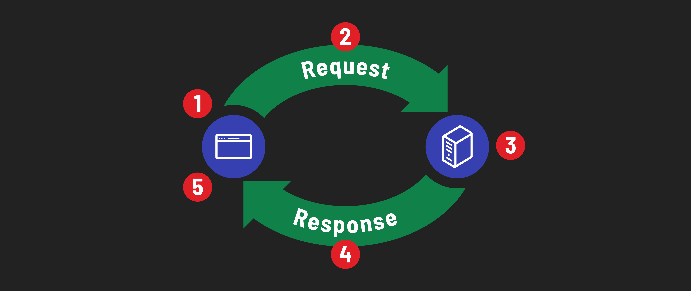

# 

**Learning objective:** By the end of this lesson, learners will be able to explain the roles of client and server software in web development, understand their interaction through the request-response cycle, and recognize the importance of this architecture in full-stack development.

## Client/Server architecture

In everyday conversation, the terms *client* and *server* are often used to describe physical devices. Typically, when people hear 'server', they imagine a large, powerful computer housed in a data center. Similarly, the term 'client' is commonly associated with personal devices, like laptops and smartphones. However, in the context of web development, these terms have a different meaning.

> 📚 As a developer, it's important to understand that the terms ***client*** and ***server*** refer to ***roles played by software***, not just physical devices. 

In web development, 'client' and 'server' describe the functions of different software processes. Understanding the interaction between the client and the server is fundamental. Let's break it down into simpler terms:

- **Client Software:** When you use a device, the software you directly interact with is known as client software. An example of this is a web browser like Chrome or Firefox. The primary role of client software is to create requests for various *services*. For instance, when you want to visit a website, your browser (acting as the client) sends a request to fetch the webpage. 

- **Server Software:** This operates at the other end of the client-server relationship. When your browser, acting as the client, requests a webpage, this request is handled by the server software. The main function of server software is to respond to these requests for *services*. Although the physical server might be located in a remote data center, our focus here is on the server's software capabilities, not the physical machine.

> 🧠 The term ***services*** is broad and encompasses various actions a server might perform in response to the client's requests, such as retrieving the correct webpage, processing data, or performing specific tasks.

### Request and response cycle

We refer to this client/server exchange as the *request-response cycle*. For example, when you type a URL into your browser and hit enter, here’s what happens:

1. A user navigates to a website in their browser by typing a URL.
2. The browser (the *client* software) creates and sends a *request* to the appropriate web *server* (the *server* software).
3. The web *server* receives the request and acts. In this case, it should respond with HTML.
4. The web *server* sends a *response* to the *client*.
5. The browser (the *client*) receives the *response* and displays the website to the user. The *request-response cycle* has concluded.

## Why does this matter for full-stack developers?

As a full-stack developer, you'll be working with both the **front end** (what the user interacts with) and the **back end** (where data is processed and stored). Understanding client/server distinction is important for many reasons:

  - You'll often set up a **server** on your own computer for development and testing. This allows you to run and test your website as if it were live on the internet.
  - During development, you'll be sending requests from your local **client** (like a browser or a testing tool) to your local **server**, mimicking the real-world process.
  - This clear separation aids students in understanding where and how different parts of a web application are executed.
  - Understanding whether an issue originates from the client or the server side can greatly streamline the debugging process. 

Remember, in this context, we're focusing on the software part of clients and servers, not the physical devices.