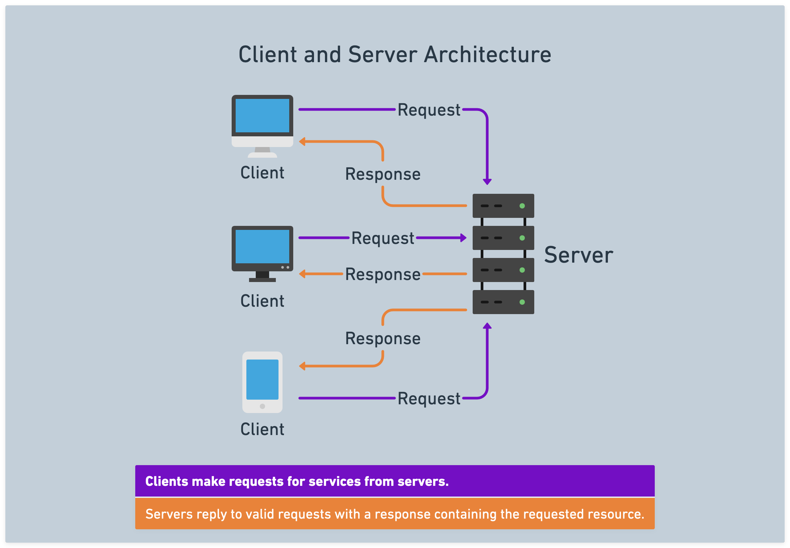

# ![[Intro to Full Stack Development] - Client/Server Architecture](./assets/hero.png)

**Learning objective:** By the end of this lesson, students will be able to define client/server architecture. 

## Client/server architecture -- a deeper dive

We've already defined client/server architecture, so let's dive into the details.

tktk hunter -- please make this prettier

In the client and server architecture, clients make requests for services from servers. Servers then reply to valid requests with a response containing the requested resource.

The terms *client* and *server* can refer to both a **physical device** (computer, tablet, phone, etc.) and to a **software process**. For example:

- Database software such as PostgreSQL and web servers like Apache are examples of software processes behaving as servers.
- Browser software such as Chrome or Firefox are examples of software clients.

Web developers usually think of a web browser when they hear client. Note that during development, your computer plays the role of BOTH client and web server.

> 📚 A *client* refers to a device or application that requests resources, data, or other services from a server, typically over a network. A *server* provides these services to their *clients*.

## Components of a client/server architecture

Typically, client/server architecture consists of three components:

- **Client**: The application that interacts with the user. Responsible for sending requests to the server and displaying the server's responses to the user.

- **Server**: The application that stores and processes data. Responsible for responding to client requests and sending appropriate responses back to the client.

- **Network**: The communication channel between the client and server. Responsible for transmitting requests and responses between the client and server. 

