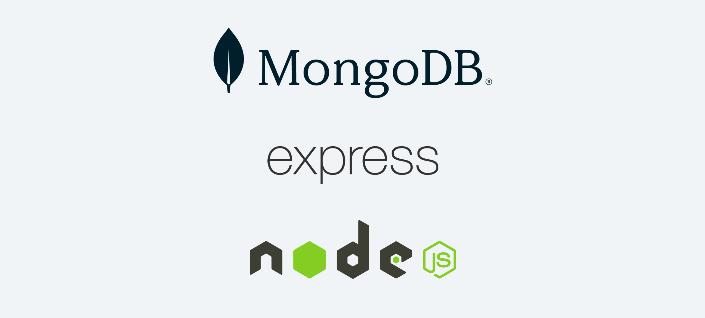
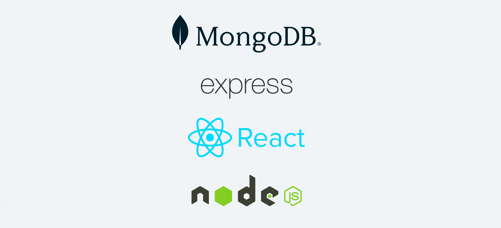
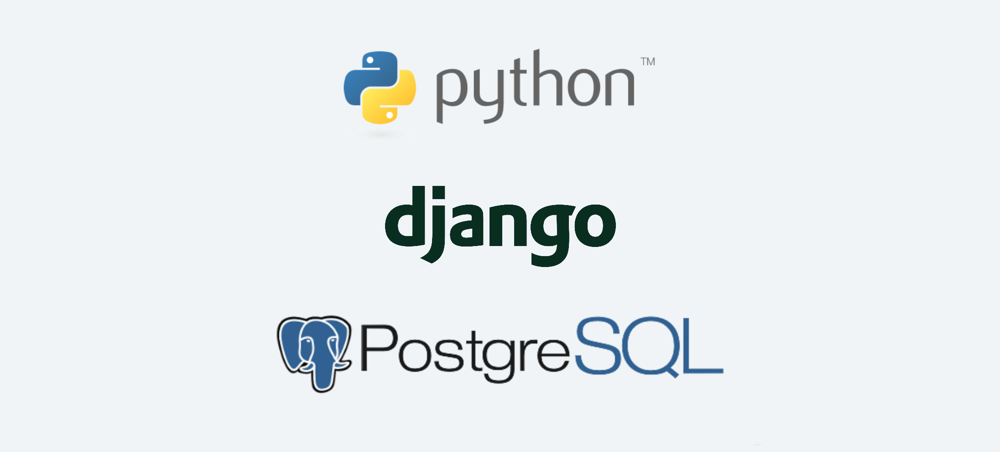

# ![[Intro to Full Stack Development] - Common Stacks Used in Modern Web Development](./assets/hero.png)

**Learning objective:** By the end of this lesson, students will know about some of the most popular web development stacks used today. 
## What is a stack?

A web development stack is a combination of programming languages, frameworks (code written by someone else to be used by you to make building an application easier), and databases which store application data.

There are a lot of stacks available, but some common ones are the **MEN stack**, the **MERN stack**, and **Python-Django-Postgres**.

### The MEN stack

The MEN stack is made up of the following technologies:

- **MongoDB**
- **Express.js**
- **Node.js**

tktk hunter -- this is ugly can you redo plz

Node.js runs JavaScript, and Express.js is a web application framework specifically for Node.js.  Like any framework, Express is not required for building applications, but it makes the process much easier.

MongoDB and Node.js are very fast technologies, which means the MEN stack is considered a high performance stack. It is also highly scalable, capable of handling a large number of concurrent users and requests. Lastly, it's fairly easy for new developers to use due in large part to the fact that Node.js is a JavaScript runtime environment. This allows developers to leverage their existing JavaScript skills to develop the server side of the web applications. 
### The MERN stack

The MERN stack is very similar to the MEN stack, but it also uses React. 

React is a front end framework known for its component-based architecture. Web developers use React to build user interfaces that are reusable and maintainable. Additionally, React is very performant, so it's a great choice for developing web applications that need to be fast and responsive.

tktk hunter -- please add some pizazz 

### Python-Django-Postgres

This stack is made up of the following technologies:

- **Python**: a general-purpose programming language.
- **Django**: a Python web framework.
- **PostgreSQL**: A relational database management system. 

tktk hunter -- same as above..

Python is one one of the most widely used technologies by developers, and Django is the most commonly used framework for building web applications in Python.  Postgres is one of the most popular relational databases in the world.  This stack is similar to the MEN stack.  Here's how the technologies match up:

- JavaScript -> Python: the programming language
- Express -> Django: the framework, used to make building the application easier
- MongoDB -> PostgreSQL: the database, used to store application data

