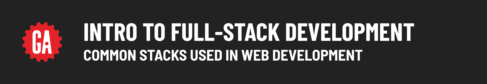
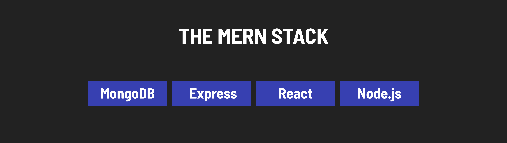
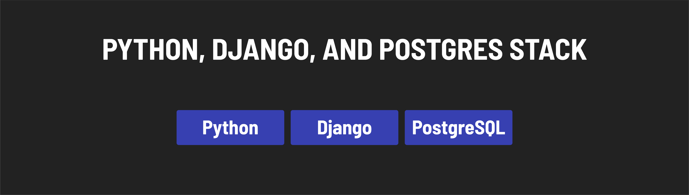

# 

**Learning objective:** By the end of this lesson, students will know about some of the most popular web development stacks used today.

## What is a stack?

A web development stack combines programming languages, large libraries/frameworks, and databases that store application data.

There are a lot of stacks available, but some common ones are the **MEN stack**, the **MERN stack**, and **Python, Django, and Postgres**.

### The MEN Stack

The MEN stack combines:

- **[MongoDB](https://www.mongodb.com/)**: A database for storing data.
- **[Express.js](https://expressjs.com/)**: A Node.js web application framework that streamlines building web applications.
- **[Node.js](https://nodejs.org/en)**: Executes JavaScript outside the browser, enabling server-side scripting.

Node.js and Express.js together offer high scalability for handling numerous users and requests. This stack is particularly friendly for JavaScript developers, as it allows them to use their existing JavaScript knowledge for server-side development, making the learning curve smoother. MongoDB complements this by handling data persistence.

### The MERN Stack

The MERN stack, similar to the MEN stack, includes React for building user interfaces. It includes:

- **MongoDB**
- **Express.js**
- **[React](https://react.dev/)**: A front-end library known for its component-based architecture, used for creating reusable, maintainable, and responsive user interfaces.
- **Node.js**

React adds a robust front-end development capability to the stack, allowing web developers to build interactive and efficient user interfaces.

### Python, Django, and Postgres Stack

This stack comprises key technologies for web application development:

- **[Python](https://docs.python.org/3/)**: A versatile programming language favored by developers for its simplicity and readability.
- **[Django](https://docs.djangoproject.com/en/5.0/)**: A highly popular Python framework for building web applications.
- **[PostgreSQL](https://www.postgresql.org/docs/)**: A widely-used relational database management system known for its reliability.

Python offers a broad base for general programming, Django extends this with specific tools for web development, and PostgreSQL provides a solid database solution. Together, they form a stack similar in functionality to the MEN stack but with different technology choices.

Here's how the technologies match up:

- **JavaScript** -> **Python**: the programming language
- **Express** -> **Django**: the framework used to make building the application easier
- **MongoDB** -> **PostgreSQL**: the database, used to store application data
