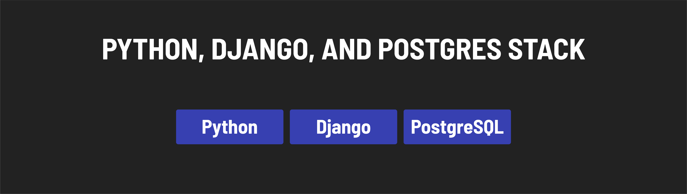

<h1>
  Intro to Full Stack Development
  Common Stacks Used in Modern Web Development
</h1>

**Learning objective:** By the end of this lesson, students will know about some of the most popular web development stacks used today.

## What is a stack?

A web development stack combines programming languages, large libraries/frameworks, and databases that store application data.

There are a lot of stacks available, but some common ones are the **MEN stack**, the **MERN stack**, and **Python, Django, and Postgres**.

### The MEN Stack

The MEN stack combines:

- **[MongoDB](https://www.mongodb.com/)**: A non-relational database for storing data.
- **[Express.js](https://expressjs.com/)**: An unopionated Node.js web framework that streamlines building web applications.
- **[Node.js](https://nodejs.org/)**: Allows for the execution of JavaScript outside the browser, enabling server-side scripting.

Node.js and Express.js together offer high scalability for handling numerous users and requests. This stack is particularly friendly for JavaScript developers, allowing them to use their existing JavaScript knowledge for server-side development, making the learning curve smoother. MongoDB complements this by handling data persistence.

### The MERN Stack

The MERN stack builds on the technologies of the MEN stack and adds [React](https://react.dev/) for building user interfaces. React is a front-end library known for its component-based architecture, which helps create reusable, maintainable, and responsive user interfaces.

### Python, Django, and Postgres Stack

This stack comprises:

- **[Python](https://www.python.org/)**: A versatile programming language developers favor for its simplicity and readability.
- **[Django](https://www.djangoproject.com/)**: A popular opinionated Python web framework.
- **[PostgreSQL](https://www.postgresql.org/)**: A widely-used, open-source relational database management system.

Python offers a broad base for general programming, Django extends this with specific tools for web development, and PostgreSQL is used as the database solution. Together, they form a stack similar in functionality to the MEN stack but with different technology choices.

Here's how the technologies match up:

- **JavaScript** -> **Python**: the programming language.
- **Express** -> **Django**: the framework used to make building the application easier.
- **MongoDB** -> **PostgreSQL**: the database, used to store application data.
