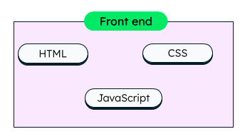
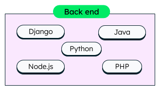

# ![[Intro to Full Stack Development] - Components of a Full Stack](./assets/hero.png)

**Learning objective:** By the end of this lesson, students will be able to define the three components of a full stack: front-end, back-end, and database.
## The three components of a full stack

The three core components of a full stack web application are the front-end, back-end, and database.
### Front-end

The front-end of a web application is the part that users interact with directly. It displays the user interface and handles user input. 

The most common front-end technologies are HTML, CSS, and JavaScript.

**HTML** defines the structure of the web page, **CSS** adds styles to the web page, and **JavaScript** adds interactivity.

tktk hunter -- also stole this from mongodb site. it may not be necessary but idk i kinda like it if you wanna redo it. 

### Back-end

A web application's back-end handles the server-side logic, such as processing user requests, storing and retrieving data, and communicating with other systems.

Common back-end technologies include Python, Ruby, Java, and Node.js.

tktk hunter - same as above
### Database

The database of a web application is where the application's data is stored and received. This includes things like user profiles, product information, order history, and many more. 

There are a lot of database technologies available, but some of the most popular are MongoDB, PostreSQL, and MySQL. Each of these has their own strengths and weaknesses.
#### The two types of databases

There are two main types of databases: **relational databases** and **non-relational databases**.

**Relational databases** store data in tables made up of rows and columns. Each row represents a single record, and each column represents a single attribute of that record. Relational databases are the most common type of databases, and are used by a wide variety of applications. MySQL and PostgreSQL are relational databases. 

**Non-relational databases** store data in a variety of different formats, such as documents, key-value pairs, and graphs. Non-relational databases are often used for applications that need to store and retrieve large amounts of unstructured data. MongoDB is a non-relational database. 
### How the three components work together

Together, the front-end, back-end, and database of a full stack web application create a complete user experience. When a user visits a website, the front-end displays the user interface and handles the user input. It may also send data to or request data from the back-end.  The back-end processes information sent to it from the front-end and generates responses.  It may also itself send information to or request information from the database.  The database is where data for the application is stored, and it responds to the server similarly to how the back-end responds to the front-end.

tktk Hunter: could use a diagram like the following, but more generic that only shows server and db without the driver, terminal, and database partitions:

For example, when a user searches for a product in the search bar of an e-commerce site, the front-end will send that product name to the back-end. The back-end will then itself query the database for any products that match the user's search and generate a response that contains the matching products. This response will be sent to the front-end, which in turn will display the list of matching products to the user.

