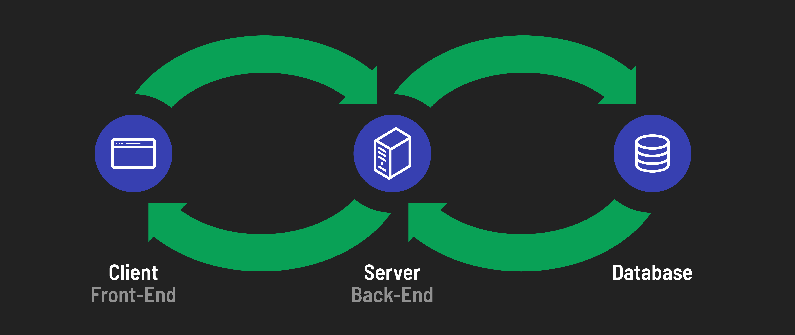

<h1>
  Intro to Full Stack Development
  Concepts
</h1>

**Learning objective:** By the end of this lesson, students will be able to explain the distinction between front-end and back-end development.

## What is full-stack development?

[Full-stack development](https://www.mongodb.com/languages/full-stack-development) involves building and managing both the front-end (client side) and back-end (server side) of web applications.

### Front-end development

Front-end development is all about what the user experiences directly in their web browser. It includes everything the user sees and interacts with, such as the layout, design, and interactivity of a website. Front-end developers focus on languages like HTML, CSS, and JavaScript to create engaging and responsive web interfaces.

### Back-end development

Back-end development, on the other hand, operates behind the scenes. It involves managing the server that hosts the website, as well as the application's data and logic. Back-end developers work on server-side programming, ensuring that data is processed correctly and the appropriate responses are sent back to the front end. They commonly use languages and technologies like Node.js, Ruby on Rails, Python, and databases such as MySQL, PostgreSQL, and MongoDB.

### The role of a full-stack developer

A full-stack developer has the skills to work on both the front-end and back-end of a web application. This comprehensive skill set allows them to build user interfaces, write server-side code, and manage databases. Working in the entire spectrum of web development makes full-stack developers highly versatile and valuable in the tech industry.

Full-stack development encompasses the entire process of building a web application: from the user interface design to server-side programming and database management.

## Why full-stack development?

Full-stack development adds a layer of security and reliability to applications because code running in a back-end application is more controlled than code running in a front-end. This is because users can see and change front-end behavior on their own devices. In contrast, they cannot see the code or observe the behavior of a back-end application.

Therefore, when we need to carry out actions that we need to place more trust in, such as interacting with a database or handling user authentication, we handle those tasks from the back-end. Beyond this, back-end applications have a couple of other benefits:

- **Build once - serve many apps**: A single back-end application can serve many different front-end applications. For example, you might use the same back-end to interact with a front-end web app and a front-end mobile app.
- **Performance**: A back-end application is likely running on a more powerful device than a front-end application, meaning more performance intensive operations can be offloaded to it.
