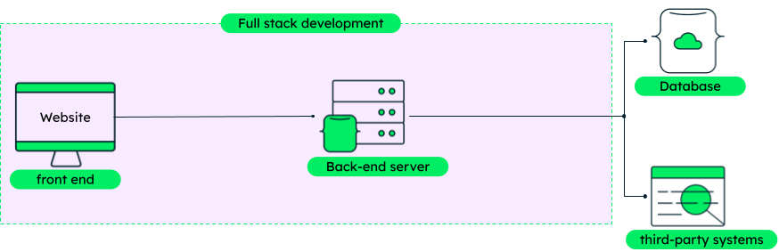

# ![[Intro to Full Stack Development] - Defining Full Stack Development and Client/Server Architecture](./assets/hero.png)

**Learning objective:** By the end of this lesson, students will be able to define full stack development.
## What is full stack development?

[Full stack development](https://www.mongodb.com/languages/full-stack-development) is the practice of building web applications from both the front-end (client-side) and back-end (server-side) perspectives. Full stack developers deeply understand front and back end technologies. They are able to work on all aspects of a web application, from building the user interface to developing the sever-side logic. 

In addition to the front-end and back-end applications that they create, full stack developers also need to have a good understanding of databases. Databases are used to store and manage the application's data. Common database technologies include MySQL, PostgreSQL, and MongoDB.

tktk hunter -- i stole this asset from the mongodb link above, but i think it's helpful. might be worth remaking but i defer to your judgement. Also this doesnt work in dark mode lol.