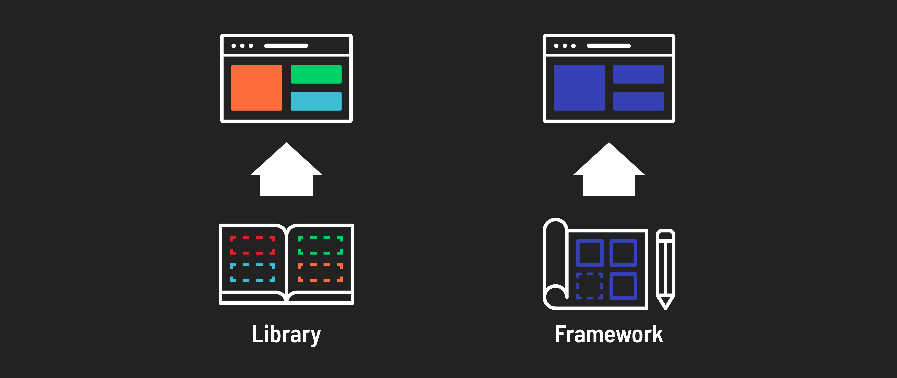

# 

**Learning objective:** By the end of this lesson, students will be able to distinguish between frameworks and libraries in software development, understand roles and benefits, and recognize the differences between opinionated and unopinionated frameworks.

## What are frameworks and libraries?

Frameworks and libraries are vital tools in software development. They leverage pre-written code to help accomplish common tasks without having to start that work from scratch. While they both aid in development, they serve different purposes:

- A *framework* provides the overarching structure for an application. It typically offers a set of rules or conventions to help standardize development. This means different applications built using the same framework will broadly look the same (for example, they'll have a similar directory structure).

- A *library*, on the other hand, offers specific functionalities that developers can integrate into their projects as needed. Libraries handle specific tasks like working with dates, formatting strings, and presenting UI elements. They don't enforce how the overall application is structured or behaves.

This analogy from [freeCodeCamp](https://www.freecodecamp.org/news/the-difference-between-a-framework-and-a-library-bd133054023f/) outlines the difference more clearly:

> A library is browsing an Ikea catalog. You already have a home, but you need a bit of help with furniture. You don’t feel like making your own table from scratch. Ikea allows you to pick and choose different things to go in your home. You are in control.

> A framework, on the other hand, is like building a model home. You have a set of blueprints and a few limited choices when it comes to architecture and design. Ultimately, the contractor and blueprint are in control. And they will let you know when and where you can provide your input.

## Benefits of using frameworks and libraries

You can create full-stack applications without using frameworks or libraries, but this makes the process more complicated and time-consuming. It frequently involves developing features from scratch that are readily available in existing frameworks or libraries.

They make a developer's job easier by:

- **Simplifying complex tasks:** They handle the complicated parts of coding by *abstracting* them, which boosts developer productivity and development speed. This is because they hide the complex details and let developers work at a simpler level.

- **Offering tested solutions:** Many frameworks and libraries are widely used and have been tested by many other developers. This means they are generally more reliable than code written from scratch.

- **Providing community support:** The large community of users is a great resource for solving problems and getting help, as they share a lot of knowledge and experience.

> 📚 *Abstraction* hides technical complexity and details irrelevant to solving a problem. It allows programmers to interact with complex systems at a simplified level without understanding the underlying information.

> It's important to note that libraries and frameworks are not programming languages themselves, but are built using languages like JavaScript, Python, etc. For example, **React** is a popular library for building user interfaces, while **Express.js** is a framework that simplifies the creation of web applications in **Node.js**.

## Types of frameworks

There are many different types of frameworks, but they can be broadly categorized into two groups: opinionated and unopinionated.

### Opinionated

Opinionated frameworks encourage or enforce a particular way of doing things the framework prescribes. Put another way, they prefer ***conventions*** over ***configuration***. This has a few pros and cons.

| Pros | Cons |
| ---- | ---- | 
|**Rapid development**: Setup and configuration are typically minimized. Apps can be built from the start with sensible defaults configured, making it easier to start a project. Developers skilled in an opinionated framework can build features at an accelerated velocity. | **Learning curve**: Developers must learn and follow a rigid structure prescribed by the framework. |
| **Consistency**: Developers have fewer decisions due to enforced conventions. Because of this, the differences between code written in the same framework are minimal. This can make it easier for multiple developers to work together on teams or get onboarded to work more quickly. | **Difficulty of customization**: Customization is often necessary, which can be more complicated than in an unopinionated framework. |
| **Best practices**: Configuration can be complicated and error-prone - opinionated frameworks try to do that work so you don't have to. Additionally, much of the code in an opinionated framework has been critiqued and honed by the community of developers that use it, making it the best it can be.|  |
| **Debugging and community support**: Because there is less customization, developers are less likely to encounter unique errors. This can make finding solutions to problems or getting help from the community around the framework easier. |  |

### Unopinionated

Unopinionated frameworks are the opposite of opinionated frameworks, allowing developers more freedom in their projects. Since these frameworks are the inverse of opinionated, they prefer ***configuration*** over ***convention***. Once again, this has a few pros and cons.

| Pros                                         | Cons                                                     |
|----------------------------------------------|----------------------------------------------------------|
| **Flexibility**: Unopinionated frameworks provide the freedom to choose the best path to solve a problem. | **Inconsistency**: The need for conventions can lead to inconsistencies in the codebase introduced by multiple developers working on the same project or development approaches changing over time. |
| **Ease of customization**: Unopionated frameworks are ideal for projects that require significant customization or when an established convention is unhelpful. | **More decisions**: More decisions have to be made by a development team, which can slow down meaningful development. |
| **Lightweight**: Unopinionated frameworks often only include the minimal parts necessary for a project. |                                                          |