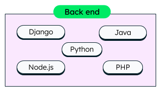

# 

**Learning objective:** By the end of this lesson, students will be able to define the three components of a full stack: front-end, back-end, and database.

## Front-end

The front-end of a web application is the part that users interact with directly. It displays the user interface, handles user input, and if necessary, communicates with a back-end via a *request*.

Browsers natively handle HTML, CSS, and JavaScript code.

**HTML** defines a web page's structure of the web page, **CSS** adds styles to the web page, and **JavaScript** adds interactivity.

Several frameworks and libraries exist to help construct front-end web applications, such as:

- Angular
- Vue.js
- React
- jQuery.

tktk hunter -- also stole this from mongodb site. it may not be necessary but idk i kinda like it if you wanna redo it. (could you include some frameworks in here too)

## Back-end

A back-end system handles the behind-the-scenes functionality of a web application.

The back-end processes user requests, makes decisions based on *business logic*, and determines the data that should be sent to the front-end via a *response*.

> 📚 *Business logic* is the part of an application's behavior that accounts for real-world business rules.
>
> Using an e-commerce application as an example, the business logic may include:
>
> - Rules for calculating the total cost of items in a shopping cart.
> - Applying any discounts.
> - Handling inventory stock updates.

The most important reason to handle these tasks on the back-end is security - doing this work there means that users cannot easily see or tamper with them. This is crucial for operations involving personal data, financial transactions, or sensitive business operations.

Beyond this, the back-end handles user authentication, communicates with other systems including the database, and more.

Common back-end languages used in web development include JavaScript (executed by Node.js), Python, Ruby, Java, C#, and PHP.

Just like on the front-end, several frameworks and libraries can be used to help construct back-end web applications, such as:

- Express.js (JavaScript)
- Flask (Python)
- Java Spring (Java)
- ASP.NET Core (C#)

tktk hunter - same as above

## Database

The data related to an application is persisted in a database. Certain kinds of data, such as textual, numeral, and boolean data, are highly suitable to be stored in a database as they can be easily cataloged, searched for, and retrieved.

Many database technologies are available, but some of the most popular are MongoDB, PostgreSQL, Oracle, and MySQL. Each of these has strengths and weaknesses.

### The two types of databases

There are two main types of databases: **relational databases** and **non-relational databases**.

**Relational databases** store data in tables made up of rows and columns. Each row represents a single record, and each column represents a single attribute of that record.

Relational databases are the most common type of databases and are used by a wide variety of applications. MySQL and PostgreSQL are examples of relational databases.

**Non-relational databases** store data in various formats, such as documents, key-value pairs, and graphs.

Non-relational databases are often used for applications that store and retrieve large amounts of unstructured data. MongoDB is an example of a non-relational database.

### How the three components work together

Together, a full-stack web application's front-end, back-end, and database create a complete user experience. Let's bring it all together with an example.

We have a simple web site that is used for creating and storing recipes. As a user of this application I can create a recipe and view all of the recipes that I have created.

The application's front-end is responsible for presenting a user-friendly form enabling recipe creation and displaying a comprehensive list of all user-generated recipes in the browser. Additionally, it manages user input, generating a *request* to the back-end upon form submission.

The back-end of the application is responsible for recieving and processing *request* from the front-end. These *request*s are used to create, read, update, and delete (CRUD) data in the database. The back-end also generates a *response* to the front-end containing the data that was requested, a success or failure message, or any other information that the front-end may need.

The database is responsible for storing the data that the application needs to function. In this case, the database stores the recipes that the user has created. In other cases databases can track the relationships between enities, store user information, and much more.

tktk Hunter: could use a diagram like the following, but more generic that only shows server and db without the driver, terminal, and database partitions:

> 📚 *Request and Response* are actually the names of two different objects in the JavaScript language. These objects are used to represent the data that is sent between the front-end and back-end of an application. These objects have predefined values and methods that make it easy to send and recieve data between the front-end and back-end of an application. Read futher on the Request Object [here](https://developer.mozilla.org/en-US/docs/Web/API/Request) and the Response Object [here](https://developer.mozilla.org/en-US/docs/Web/API/Response).
