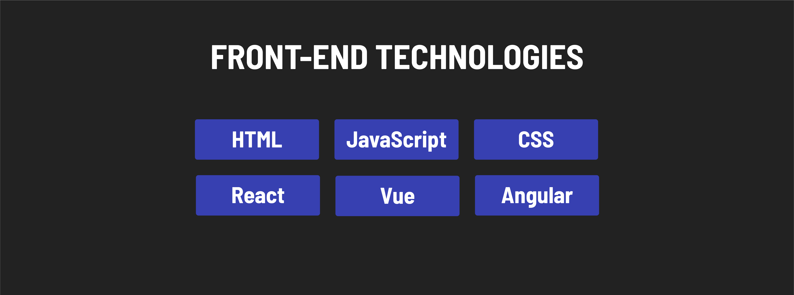
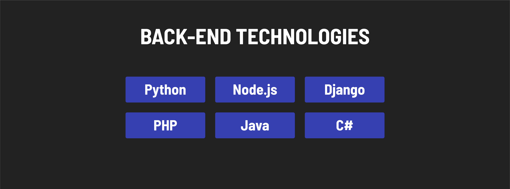
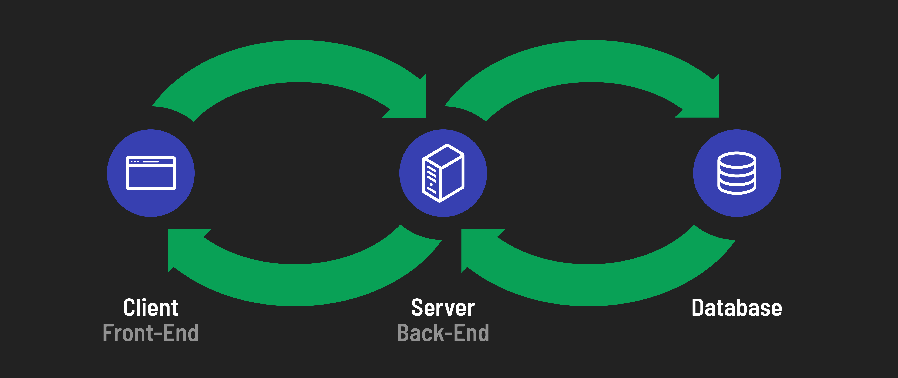

<h1>
  Intro to Full Stack Development
  The Building Blocks of Full Stack Web Apps
</h1>

**Learning objective:** By the end of this lesson, students will be able to define the three components of a full stack: front-end, back-end, and the database.

## Front-end

The front-end of a web application is the part that users interact with directly. It displays the user interface, handles user input, and, if necessary, communicates with a back-end via a *request*.

Browsers natively support HTML, CSS, and JavaScript, which are the core technologies of front-end development.

- **Key Technologies**:
  - **HTML**: Structures the web page.
  - **CSS**: Styles the web page.
  - **JavaScript**: Adds interactivity to the web page.

- **Popular Tools**: Frameworks and libraries that assist in front-end development include:
  - Angular
  - Vue.js
  - React
  - jQuery

## Back-end

The back-end is the behind-the-scenes functionality of a web application. It processes user requests, applies business logic, and sends data back to the front-end via a *response*.

- **Key Responsibilities**:
  - Ensures security for sensitive data and transactions.
  - Handles user authentication and database communication.
  - Manages *business logic* like calculating costs, applying discounts, and updating inventory.

- **Popular Languages**:
  - JavaScript (Node.js)
  - Python
  - Ruby
  - Java
  - C#
  - PHP

- **Popular Tools**: Frameworks and libraries for back-end development include:
  - Express.js (JavaScript)
  - Flask (Python)
  - Java Spring (Java)
  - ASP.NET Core (C#)

> 📚 *Business logic* refers to the application behavior that reflects real-world business rules. For instance, in an e-commerce app, it includes calculating shopping cart totals, applying discounts, and handling inventory.

## Database

The data related to an application is persisted in a database. Certain kinds of data, such as textual, numeral, and boolean data, are highly suitable to be stored in a database as they can be easily cataloged, searched for, and retrieved.

Many database technologies are available, but some of the most popular are MongoDB, PostgreSQL, Oracle, and MySQL. Each of these has strengths and weaknesses.

### Two types of databases

There are two main types of databases: ***relational databases*** and ***non-relational databases***.

- **Relational Databases**:
  - **How they store data**: In tables with rows and columns. Each row represents a single record, and each column represents a single attribute of that record.
  - **Use**: Widely used across various applications. These database types are preferred when servicing apps that require a high volume of database transactions, such as banking.
  - **Examples**: MySQL, PostgreSQL, Oracle

- **Non-Relational Databases**:
  - **How they store data**: In various formats such as documents, key-value pairs, and graphs.
  - **Use**: Suitable for applications with large amounts of unstructured data or complex relationships between data.
  - **Examples**: MongoDB, Redis, Elasticsearch

Relational databases are the most traditional and common, while non-relational databases offer flexible data models for specific use cases.

### How the three components work together

In a full-stack web application, the front-end, back-end, and database work together to provide a complete user experience.

Let's bring it all together with an example.

A recipe creation website.

- **Front-end**:
  - Presents a user interface for creating and viewing recipes.
  - Handles user input and sends ***requests*** to the back-end.

- **Back-end**:
  - Processes ***requests*** from the front-end.
  - Performs create, read, update, and delete (CRUD) operations on the database.
  - Sends ***responses*** back to the front-end.

- **Database**:
  - Stores data, such as user-created recipes and information about users.
  - Tracks relationships between pieces of data (such as a recipe and comments on a recipe).

This example illustrates how each component plays a crucial role in the functionality of a web application, working in unison to interact with, persist, and display data.
